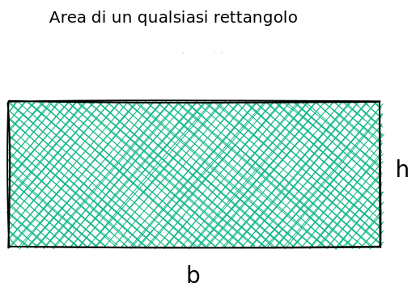
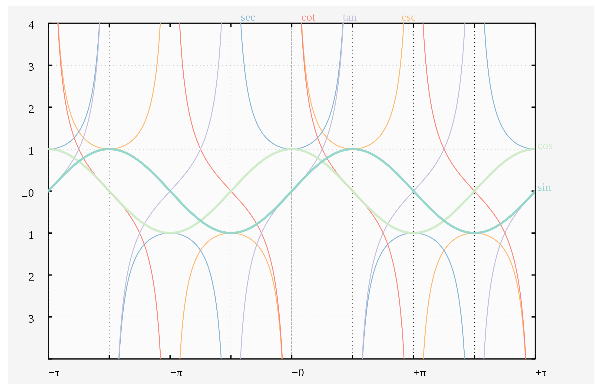
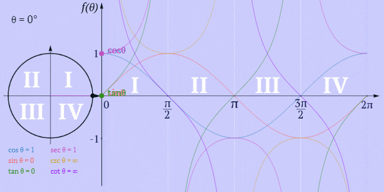
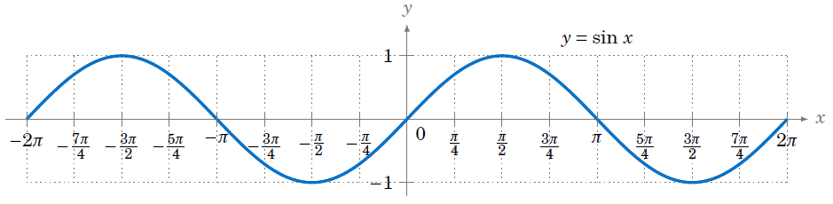
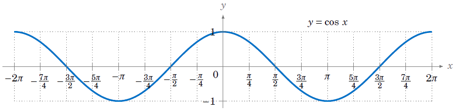
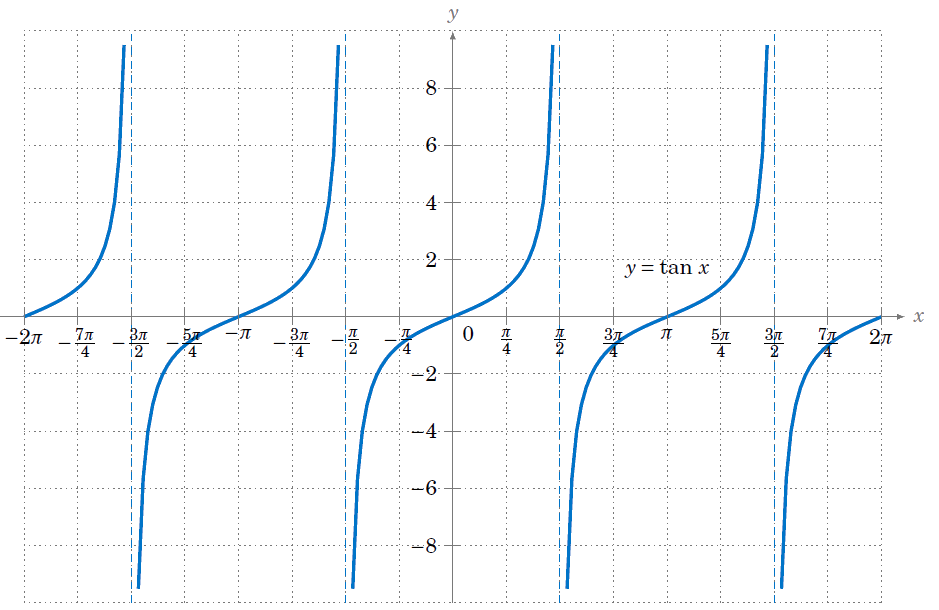



<section data-transition="convex">
  <h2 style="color:#3B2F2F" class="r-fit-text">CALCOLO   LETTERALE</h2>
  <h3 style="color:#3B2F2F"><em>- Rif.: Capitolo 5 -</em></h3>
  <h5 style="color:#8A4117"><em>prof. diego fantinelli</em></h5>
  
<em>matematica per il biennio &mdash; classi prime</em>

  
ITIS "Enrico Fermi" - Bassano del Grappa

</section>

<!-- <section>

</section> -->

<!-- prerequisiti-->
---



<section style="font-size:90%" data-transition="convex">
  <h2 style="color:#3B2F2F">Prerequisiti</h2>

  <ul class="fragment">
  <li class="fragment"><h3 style="color:#8A4117">insiemi numerici:</h3></li>
    <ul class="fragment">
      <li>Operazioni e nomenclatura insiemistiche</li>
      <li>Operazioni in $\mathbb{N}, \mathbb{Z}, \mathbb{Q}, \mathbb{R}$</li>
    </ul>
  

  <li class="fragment"><h3 style="color:#8A4117">teoria degli insiemi</h3></li>
    <ul class="fragment">
      <li>Rappresentazioni: estensiva, intensiva e Diagrammi di Eulero-Venn</li>
      <li>Prodotto Cartesiano: definizione e rappresentazione</li>
    </ul>
</section>

---



<section>
  <h3 class="fragment" style="color:#FFFFFF; font-size: 60px;">una riflessione per iniziare...</h3>
  <h3 class="fragment" style="color:#FFFFFF; font-size: 40px;"><em>“I know not with what weapons World War III will be fought, but World War IV will be fought with sticks and stones.”
   &mdash; Albert Einstein</em></h3>
</section>

---



<section data-background-video="teaching.mp4" data-background-opacity="0.7" data-transition="zoom">
  <h2 style="color:#FFFFFF;" class="r-fit-text">Il Calcolo</h2>
  <h2 style="color:#FFFFFF;" class="r-fit-text">Letterale</h2>
</section>

<!-- esercizi -->

<section>
  <h2 style="color:#3B2F2F">Esercizi</h2>
  <ul class="r-fit-text">
    <li class="fragment highlight-current-red">$-2 a^{2} s^{2}+\dfrac{7}{6} a^{2} s^{2}-\dfrac{5}{27} a^{2} s^{2}+\dfrac{11}{15} a^{2} s^{2}+\dfrac{3}{10} a^{2} s^{2}+\dfrac{5}{27} a^{2} s^{2}-\dfrac{6}{5} a^{2} s^{2}$</li>
    <li class="fragment highlight-current-red">$\left(-2 x^{2} y^{3}+\dfrac{5}{2} x^{2} y^{3}-\dfrac{1}{6} x^{2} y^{3}\right)-\left(\dfrac{13}{12} x^{2} y^{3}-\dfrac{11}{4} x^{2} y^{3}+x^{2} y^{3}\right)$</li>
    <li class="fragment highlight-current-red">$\left(-\dfrac{7}{20} a+\dfrac{11}{30} a-\dfrac{7}{12} a+\dfrac{1}{15} a\right)-\left(\dfrac{3}{8} a-\dfrac{7}{20} a-\dfrac{2}{5} a\right)$</li>
    <li class="fragment highlight-current-red">$-\dfrac{2}{5} a^{3}+\dfrac{15}{8} a^{2} b-\dfrac{8}{15} a^{2}-\dfrac{3}{5} a^{3}+\dfrac{8}{15} a^{2}+a^{3}-\dfrac{7}{8} a^{2} b$</li>
    <li class="fragment highlight-current-red">$\dfrac{11}{10} s^{3} t-\dfrac{11}{10} s t^{3}+\dfrac{3}{5} s t^{3}-\dfrac{31}{35} s^{3} t-\dfrac{3}{5} s-\dfrac{3}{14} s^{3} t+\dfrac{3}{5} s+\dfrac{3}{2} t^{3}$</li>
    <li class="fragment highlight-current-red">$-\dfrac{1}{10} x y^{2}-\dfrac{1}{9} x^{2} y+\dfrac{5}{6} x y^{2}+\dfrac{4}{3}+\dfrac{1}{9} x^{2} y-\dfrac{11}{15} x y^{2}-\dfrac{5}{6}$</li>
    <li class="fragment highlight-current-red">$\dfrac{1}{6} x y+\dfrac{5}{3} x-\left[\dfrac{1}{24} x y-\left(\dfrac{1}{12} x y-\dfrac{7}{8} x y+\dfrac{1}{6} x y\right)+2 x-\dfrac{1}{3} x\right]$</li>
  </ul>
</section>

<section>

</section>

<section data-background-video="archery.mp4" data-background-opacity="0.8" data-transition="convex">
  <h2 class="r-fit-text" style="color:#FFFFFF">Definizioni</h2>
</section>

<section data-transition="convex">
  <h2 class="fragment" style="color:#3B2F2F" class="r-fit-text">Dominio e Codominio $\mathscr{R}$</h2>
  <h4 class="fragment" style="text-align:left; color:#3B2F2F;">Dominio di una relazione $D$:</h4>
  <q class="fragment" style="color:#C04000; font-size:80%; background-color:#F3E5AB;">si dice <b>dominio</b> di una relazione $\mathscr{R}$ tra due insiemi $A$ e $B$ l'insieme degli elementi di $A$ che sono associati ad <b>almeno un</b> elemento di $B$.</q>
   
  <h4 class="fragment" style="text-align:left; color:#3B2F2F;">Codominio di una relazione $C$:</h4>
  <q class="fragment" style="color:#C04000; font-size:80%; background-color:#F3E5AB;">si dice <b>codominio</b> di una relazione $\mathscr{R}$ tra due insiemi $A$ e $B$ l'insieme degli elementi di $B$ che sono associati ad <b>almeno un</b> elemento di $A$.</q>
</section>  

<section data-transition="convex">
  <h2 class="fragment" style="color:#3B2F2F" class="r-fit-text">Immagine e Controimmagine</h2>
  <h4 class="fragment" style="text-align:left; color:#3B2F2F;">Immagine di una relazione:</h4>
  <q class="fragment" style="color:#C04000; font-size:80%; background-color:#F3E5AB;">si dice <b>immagine</b> di una relazione $\mathscr{R}$ tra due insiemi $A$ e $B$ l'insieme degli elementi di $A$ che sono associati ad <b>almeno un</b> elemento di $B$.</q>
   
  <h4 class="fragment" style="text-align:left; color:#3B2F2F;">Controimmagine di una relazione:</h4>
  <q class="fragment" style="color:#C04000; font-size:80%; background-color:#F3E5AB;">si dice <b>controimmagine</b> di una relazione $\mathscr{R}$ tra due insiemi $A$ e $B$ l'insieme degli elementi di $B$ che sono associati ad <b>almeno un</b> elemento di $A$.</q>
</section>

<section data-transition="convex">
  <h2 class="fragment" style="color:#3B2F2F" class="r-fit-text">Dominio e Codominio $\mathscr{R}$</h2>
  <h4 class="fragment" style="color:#3B2F2F" class="r-fit-text"><em>tramite le def. di <b>immagine</b> e <b>controimmagine</b></em></h4>
  <h4 class="fragment" style="text-align:left; color:#3B2F2F;">Dominio di una relazione (D):</h4>
  <q class="fragment" style="color:#C04000; font-size:80%; background-color:#F3E5AB;">si dice <b>dominio</b> di una relazione $\mathscr{R}$ tra due insiemi $A$ e $B$ l'insieme degli elementi di $A$ che hanno <b>almeno una immagine</b> in $B$.</q>
   
  <h4 class="fragment" style="text-align:left; color:#3B2F2F;">Codominio di una relazione (C):</h4>
  <q class="fragment" style="color:#C04000; font-size:80%; background-color:#F3E5AB;">si dice <b>codominio</b>di una relazione $\mathscr{R}$ tra due insiemi $A$ e $B$ l'insieme degli elementi di $B$ che hanno <b>almeno una controimmagine</b> in $A$</q>
</section>

<section data-transition="convex">
<h2 style="color:#8A4117" class="r-fit-text">proprietà delle relazioni:</h2>
<ul class="fragment" style="font-size:80%">
  <li class="fragment"><b>Riflessiva:</b> ogni elemento è in relazione con se stesso: $\forall x \in A, x \mathscr{R} y$</li>
  <li class="fragment"><b>Antiriflessiva:</b> nessun elemento è in relazione con se stesso: $\forall x \in A, x \cancel{\mathscr{R}} y$</li>
  <li class="fragment"><b>Simmetrica:</b> se $x$ è in relazione con $y$, allora $y$  è in relazione con $x$:  $(x \mathscr{R} y) \vee (y \mathscr{R} z) \longrightarrow x \mathscr{R} z$, con $x, y, z \in A$</li>
  <li class="fragment"><b>Antisimmetrica:</b> se $x$ è in relazione con $y$ e $y$ è in relazione con $x$, allora $x=y$:  $(x \mathscr{R} y) \wedge (y \mathscr{R} x) \longrightarrow x = y$, con $x, y \in A$</li>
  <li class="fragment"><b>Transitiva:</b> se $x$ è in relazione con $y$, e $y$ è in relazione con "z" allora $x$ è in relazione con $z$: $(x \mathscr{R} y) \wedge (y \mathscr{R} z) \longrightarrow x \mathscr{R} z$, con $x, y, z \in A$</li>
</ul>
</section>

<section data-transition="convex">
<h2 style="color:#8A4117">Relazioni di equivalenza</h2>
<h4 class="fragment" style="text-align:left; background-color:#F3E5AB; font-size:80%"><b>definizione:</b><em> una relazione $\mathscr{R}$ definita in un insieme $A$ è una relazione di equivalenza se gode delle proprietà riflessiva, simmetrica e transitiva. Se $\mathscr{R}$ è una relazione di equivalenza, due elementi in relazione tra loro si dicono <b>equivalenti</b> rispetto a $\mathscr{R}$</em></h4>
<ul style="font-size:85%">
  <li class="fragment" style="color:#8A4117;"><em>I sottoinsiemi di $A$ costituiti da elementi tutti equivalenti fra loro rispetto alla relazione di equivalenza $\mathscr{R}$ si dicono <b>classi di equivalenza</b> di $\mathscr{R}$.</em></li>
  <li class="fragment" style="color:#8A4117;"><em>Essi costituiscono una partizione di $A$ e l’insieme che ha per elementi le classi di equivalenza rispetto a $\mathscr{R}$ si chiama insieme <b>quoziente.</b></em></li>
</ul>
</section>

<section data-transition="convex">
  <h2 style="color:#8A4117">Relazioni d'ordine</h2>
  <h4 class="fragment" style="text-align:left; background-color:#F3E5AB; font-size:80%"><em><b>definizione:</b> relazione $\mathscr{R}$ che gode delle proprietà <b>antisimmetrica</b> e <b>transitiva</b></em></h4>
  <ul style="font-size:85%">
    <li class="fragment" style="color:#8A4117;"><em>Se $\mathscr{R}$ è anche <b>antiriflessiva</b>, essa è detta relazione <b>d’ordine stretto</b></em></li>
    <li class="fragment" style="color:#8A4117;"><em>Se $\mathscr{R}$ è anche <b>riflessiva</b>, essa è detta relazione <b>d’ordine largo</b></em></li>
    <ul style="font-size:80%">  
      <li class="fragment" style="color:#8A4117;"><em>in particolare:</em></li>
      <li class="fragment" style="color:#8A4117;"><em>se $\mathscr{R}$ è una relazione d’ordine e $x \mathscr{R} y$, si dice che $x$ precede $y$ o che $y$ segue $x$ in $\mathscr{R}$</em></li>
      <li class="fragment" style="color:#8A4117;"><em>se $\forall x\in A$ e $\forall y \in A$ tali che $x \neq y$ risulta $(x \mathscr{R} y) \wedge (y \mathscr{R} x)$, allora si dice che $\mathscr{R}$ è una relazione <b>d’ordine totale</b>.  Altrimenti $\mathscr{R}$ è detta relazione <b>d’ordine parziale</b></em></li>
  </ul>
</section>

---



<section data-transition="convex">
<h2 style="color:#3B2F2F; font-size:120pt">Funzioni</h2>
<h3 class="fragment" style="text-align:left; color:#3B2F2F;">definizione: $f: X \longrightarrow Y$</h3>
<q class="fragment" style="color:#C04000; font-size:90%; background-color:#F3E5AB;">Dati due insiemi non vuoti $X$ e $Y$, si dice <b>funzione</b> tra $X$ e $Y$, una <b>legge</b> che associa <b>ad ogni</b> elemento $x$ dell’insieme $X$
<b>uno e uno solo</b> elemento $y$ dell’insieme $Y$</q>
<ul style="font-size:85%">
  <li class="fragment"><h4>si scrive: $f: x \in X \longrightarrow y \in Y$</h4></li>
  <li class="fragment"><h4>oppure, nella forma più compatta: $y=f(x)$</h4></li>
</ul>
</section>

<section data-transition="convex">
  <h2 style="color:#3B2F2F" class="r-fit-text">definizioni importanti</h2>
  
<em><b>Dominio:</b> In una funzione il <b>dominio</b> coincide - a meno di punti particolari - con l'insieme di partenza;</em>

  
<em><b>Codominio:</b> In una funzione il <b>dominio</b> coincide - a meno di punti particolari - con l'insieme di partenza;</em>

  
<em><b>Immagine:</b> In una funzione il <b>dominio</b> coincide - a meno di punti particolari - con l'insieme di partenza;</em>

  
<em><b>Contro-Immagine:</b> In una funzione il <b>dominio</b> coincide - a meno di punti particolari - con l'insieme di partenza;</em>

</section>

---



<section>
  <h2 style="color:#3B2F2F" class="r-fit-text">Proprietà delle   funzioni</h2>
</section>

<section style="text-align:left;">
<h2 style="color:#8A4117">Funzioni INIETTIVE</h2>
<h4 class="fragment" style="text-align:left; color:#8A4117;">definizione:</h4>
<q class="fragment" style="color:#C04000; font-size:90%; background-color:#F3E5AB;">Dati due insiemi non vuoti $A$ e $B$, si dice **relazione** tra $A$ e $B$ - e si indica con $\mathcal{R}$ -, una **legge** che associa elementi dell’insieme $A$ con elementi dell’insieme $B$.</q>
</section>

<section>
<h3 class="fragment" style="text-align:left">esempio</h3>
<h4 class="fragment" style="text-align:left">❖ <em>Consideriamo la seguente funzione: </em></h4>

$$y=f(x)=x^2$$

</section>

<section>
<h3 style="color:#8A4117">Funzioni SURIETTIVE</h3>
<h4 class="fragment" style="text-align:left; color:#8A4117;">definizione:</h4>
<q class="fragment" style="color:#C04000; font-size:90%; background-color:#F3E5AB;">Dati due insiemi non vuoti $A$ e $B$, si dice **relazione** tra $A$ e $B$ - e si indica con $\mathcal{R}$ -, una **legge** che associa elementi dell’insieme $A$ con elementi dell’insieme $B$.</q>
</section>

<section>
<h3 class="fragment" style="text-align:left">esempio</h3>
<h4 class="fragment" style="text-align:left">❖ <em>Consideriamo la seguente funzione: </em></h4>

$$y=f(x)=x^2$$

</section>

<section>
<h2 style="color:#8A4117">Funzioni BIUNIVOCHE</h2>
<h4 class="fragment" style="text-align:left; color:#8A4117;">definizione:</h4>
<q class="fragment" style="color:#C04000; font-size:90%; background-color:#F3E5AB;">Dati due insiemi non vuoti $A$ e $B$, si dice **relazione** tra $A$ e $B$ - e si indica con $\mathcal{R}$ -, una **legge** che associa elementi dell’insieme $A$ con elementi dell’insieme $B$.</q>
</section>

<section>
<h3 class="fragment" style="text-align:left">esempio</h3>
<h4 class="fragment" style="text-align:left">❖ <em>Consideriamo la seguente funzione: </em></h4>

$$y=f(x)=x^2$$

</section>

<section>
<h2 style="color:#8A4117">Funzioni invertibili</h2>
<h4 class="fragment" style="text-align:left; color:#8A4117;">definizione:</h4>
<q class="fragment" style="color:#C04000; font-size:90%; background-color:#F3E5AB;">Dati due insiemi non vuoti $A$ e $B$, si dice **relazione** tra $A$ e $B$ - e si indica con $\mathcal{R}$ -, una **legge** che associa elementi dell’insieme $A$ con elementi dell’insieme $B$.</q>
</section>

<section>
<h3 class="fragment" style="text-align:left">esempio</h2>
<h4 class="fragment" style="text-align:left">❖ <em>Consideriamo la seguente funzione: </em></h4>

$$y=f(x)=x^2$$

</section>

<section>
<h2 style="color:#8A4117">Funzione inversa</h2>
<h4 class="fragment" style="text-align:left; color:#8A4117;">definizione:</h4>
<q class="fragment" style="color:#C04000; font-size:90%; background-color:#F3E5AB;">Dati due insiemi non vuoti $A$ e $B$, si dice **relazione** tra $A$ e $B$ - e si indica con $\mathcal{R}$ -, una **legge** che associa elementi dell’insieme $A$ con elementi dell’insieme $B$.</q>
</section>

<section>
<h3 class="fragment" style="text-align:left">esempio</h3>
<h4 class="fragment" style="text-align:left">❖ <em>Consideriamo la seguente funzione: </em></h4>

$$y=f(x)=x^2$$

</section>

<section>
<h2 style="color:#3B2F2F" class="r-fit-text">osservazioni</h2>

<ul style="font-size:80%;">
  <li>In una funzione il <b>dominio</b> coincide - a meno di punti particolari - con l'insieme di partenza;</li>
  <li>$\gamma$ è un “forgetting factor” (fattore dimenticando) che rende gli eventi degli studi più recenti più influenti rispetto a quelli precedenti;</li>
  <li>$CRj$ è la gratificazione ottenuta dalla scelta su un processo $j$;</li>
  <li>$EVj$ è la valutazione del rischio su di un processo $j$;</li>
</ul>
</section>

---



<section data-transition="convex">
  <h3 style="color:#3B2F2F" class="r-fit-text">Funzioni   notevoli</h3>
  <h3 style="color:#3B2F2F" class="r-fit-text">e loro rappresentazioni grafiche</h3>
</section>

<section data-transition="convex">
  <h3 style="color:#3B2F2F" class="r-fit-text">Il Diagramma   cartesiano</h3>

</section>

<section data-transition="convex">
<h3 class="fragment" style="text-align:left">proporzionalità lineare</h3>
<h4 class="fragment" style="text-align:left">❖ <em>Consideriamo la seguente funzione: </em></h4>

$$y=f(x)=x^2$$

</section>

<section data-transition="convex">
<h3 class="fragment" style="text-align:left">proporzionalità quadratica</h3>
<h4 class="fragment" style="text-align:left">❖ <em>Consideriamo la seguente funzione: </em></h4>

$$y=f(x)=x^2$$

</section>

<section data-transition="convex">
<h3 class="fragment" style="text-align:left">proporzionalità inversa</h3>
<h4 class="fragment" style="text-align:left">❖ <em>Consideriamo la seguente funzione: </em></h4>

$$y=f(x)=x^2$$

</section>

---



<section data-transition="convex">
<h2 class="r-fit-text">funzioni goniometriche</h2>

</section>

<section data-transition="convex">
<h2 class="r-fit-text" style="text-align:left">La circonferenza goniometrica</h2>

</section>

<section data-transition="convex">
<h2 class="fragment" style="text-align:left">la funzione <em>seno</em></h2>
<h4 class="fragment" style="text-align:left">❖ Consideriamo la seguente funzione: $y=\sin{x}$</h4>

$$y=f(x)=sinx$$

</section>

<section data-transition="convex">
<h2 class="fragment" style="text-align:left">la funzione <em>babau</em></h2>
<h4 class="fragment" style="text-align:left">❖ Consideriamo la seguente funzione: $y=\sin{x}$</h4>

$$y=f(x)=sinx$$

</section>

<section data-transition="convex">
<h2 class="fragment" style="text-align:left">la funzione <em>coseno</em></h2>
<h4 class="fragment" style="text-align:left">❖ Consideriamo la seguente funzione: $y=\cos{x}$</h4>

$$y=f(x)=sinx$$

</section>

<section data-transition="convex">
<h2 class="fragment" style="text-align:left">La funzione <em>tangente</em></h2>
<h4 class="fragment" style="text-align:left">❖ <em>Consideriamo la seguente funzione: $y=\tan{x}$</em></h4>

$$y=f(x)=tanx$$

</section>

---

<section data-background-image="heart_01.gif" data-background-opacity="0.7" data-transition="zoom">
  <h2 class="fragment; r-fit-text" style="color:#F3E5AB">esempi di funzione</h2>
  <h2 style="color:#F3E5AB" class="fragment r-fit-text">nella vita reale</h2>
</section>

<section data-background-image="heart_01.gif" data-background-opacity="0.3" data-transition="convex">
  <h2 class="fragment" style="background-color:powderblue;">l'elettrocardiogramma</h2>
  <h3 class="fragment" style="background-color:powderblue;">che cos'é l'elettrocardiogramma</h3>
  <h4 class="fragment" style="color:charcoal; text-align:left; font-size:90%"><em>L’elettrocardiogramma (ECG) è un esame cardiologico di tipo strumentale che viene eseguito in ambulatorio, o al letto del paziente qualora si trovi in ospedale o a domicilio, mediante il quale è possibile registrare e visualizzare graficamente l'attività elettrica del cuore.  <b>Dalla successiva valutazione della rappresentazione grafica, il cardiologo ottiene indicazioni utili sullo stato del cuore.</b></em></h4>
</section>

<section data-background-image="heart_01.gif" data-background-opacity="0.3" data-transition="convex">
  <h2 class="fragment" style="background-color:powderblue;">matematicamente</h2>
  
</section>

<section data-background-image="heart_01.gif" data-background-opacity="0.3" data-transition="convex">
  <h2 class="fragment" style="background-color:powderblue;">l'elettrocardiogramma</h2>
  <h4 class="fragment" style="background-color:powderblue;">A che cosa serve l'ECG?</h4>
  <ul style="color:charcoal; text-align:left; font-size:85%">
    <li class="fragment" style="font-size:85%">L’elettrocardiogramma fornisce numerose informazioni sullo stato di salute del cuore: consente infatti di misurare la frequenza cardiacaindividuare eventuali aritmie e turbe della conduzione, sospettare un aumento di dimensione delle camere cardiache, e squilibri elettrolitici.</li>
    <li class="fragment" style="font-size:85%">L’elettrocardiogramma si modifica anche in presenza di numerose condizioni patologiche cardiache, come per esempio l’ischemia acuta, la pericardite, la sindrome di Tako-Tsubo, le cardiomiopatie e in esiti di precedenti infarti.</li>
  </ul>
</section>

<section data-background-image="heart_01.gif" data-background-opacity="0.3" data-transition="convex">
  <h2 style="background-color:powderblue;">l'elettrocardiogramma</h2>
  <h4 style="background-color:powderblue;">A che cosa serve l'ECG?</h4>
  <ul class="fragment" style="color:charcoal; text-align:left; font-size:85%">
    <li class="fragment" style="font-size:85%">L’elettrocardiogramma può essere eseguito a riposo (standard), con il paziente sdraiato sul lettino, o sotto sforzo, con il paziente che cammina su un tapis roulant o pedala su una cyclette. L’elettrocardiogramma sotto sforzo permette di individuare patologie cardiache latenti.</li>
    <li class="fragment" style="font-size:85%">Vi è poi un terzo tipo di elettrocardiogramma, denominato elettrocardiogramma secondo Holter o dinamico, che offre la possibilità di monitorare la funzione cardiaca nell'arco di un certo periodo di tempo, in genere 24 ore.</li>
  </ul>
</section>

<section data-background-image="heart_01.gif" data-background-opacity="0.3" data-transition="convex">
  <h4 class="fragment" style="background-color:powderblue; text-align:left">le variabili coinvolte:</h4>
  <ul class="fragment r-fit-text" style=" color:charcoal; font-size:65%">
    <li><em>Onda P</em>: piccola onda positiva, indica la depolarizzazione atriale (attivazione elettrica degli atri)</li>
    <li><em>Intervallo PR</em>: distanza fra l’inizio dell’onda P e l’inizio del complesso QRS, rappresenta l’intervallo necessario perché la depolarizzazione atriale raggiunga i ventricoli</li>
    <li><em>Complesso QRS</em>: rappresenta la depolarizzazione ventricolare</li>  
    <li><em>Onda Q</em>: prima deflessione negativa</li>
    <li><em>Onda R</em>: prima deflessione positiva</li>
    <li><em>Onda S</em>: seconda deflessione negativa</li>
    <li><em>Tratto ST</em>: distanza fra l’onda S e l’inizio dell’onda T, rappresenta l’intervallo fra la depolarizzazione ventricolare e l’inizio della ripolarizzazione ventricolare (ripristino delle condizioni elettriche di base)</li>
    <li><em>Onda T</em>: prima onda positiva successiva al complesso QRS, rappresenta la ripolarizzazione ventricolare</li>
    <li><em>Intervallo QT:</em> distanza fra l’inizio del QRS e la fine dell’onda T, rappresenta l’intera attività elettrica ventricolare</li>
    <li><em>Onda U:</em> onda positiva successiva all’onda T, non sempre presente, rappresenta la ripolarizzazione delle fibre del Purkinje</li>
  </ul>
</section>

<section data-background-image="heart_01.gif" data-background-opacity="0.4" data-transition="convex">
  <h3 class="fragment; r-fit-text">matematicamente...</h3>
  <ul>
    <li class="fragment" style="font-size:80%"><em>Attualmente la tecnica più utilizzata per il riconoscimento on line del complesso QRS è quella del filtraggio digitale.</em></li>
    <li class="fragment" style="font-size:80%"><em>Un filtro è una trasformazione lineare che al segnale $x_{t}$ associa un segnale $y_{t}$ definito da una funzione del tipo:</em></li>
  </ul>
  <h3 class="fragment" style="color:#7E391C;">$$ y_{t}=\sum_{k=1}^{n} f(k) y_{t-k}+\sum_{i=1}^{m} g(i) x_{t-i}$$</h3>
</section>

---



<section>
<h3 class="fragment">La funzione Happiness</h3>

$\textbf{Happiness(t)}=w_{0}+w_{1} \cdot\displaystyle{\sum_{j=1}^{t}} \gamma^{t-j} C R_{j}+w_{2} \cdot\sum_{j=1}^{t} \gamma^{t-j} E V_{j}+w_{3} \cdot\sum_{j=1}^{t} \gamma^{t-j} R P E_{j}$

<ul style="font-size:80%;">
  <li class="fragment">$t$; $w_0$, $w_1$, $w_2$ e $w_3$ sono costanti che indicano l’influenza dei diversi tipi di eventi;</li>
  <li class="fragment">$\gamma$ è un “forgetting factor” (fattore dimenticando) che rende gli eventi degli studi più recenti più influenti rispetto a quelli precedenti;</li>
  <li class="fragment">$CRj$ è la gratificazione ottenuta dalla scelta su un processo $j$;</li>
  <li class="fragment">$EVj$ è la valutazione del rischio su di un processo $j$;</li>
  <li class="fragment">$RPEj$ rappresenta la differenza tra la ricompensa desiderata e quella effettivamente ottenuta dal processo $j$.</li>
</ul>

</section>

---



<section>
  <h2 style="color:#ffffff" class="r-fit-text">DOMANDE?</h2>
</section>

---

<section data-background-color="#EDEDED">
  
</section>